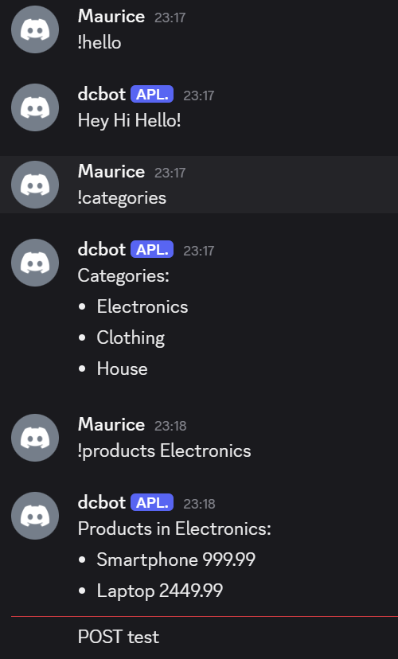
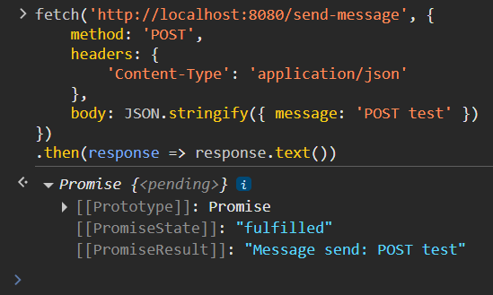
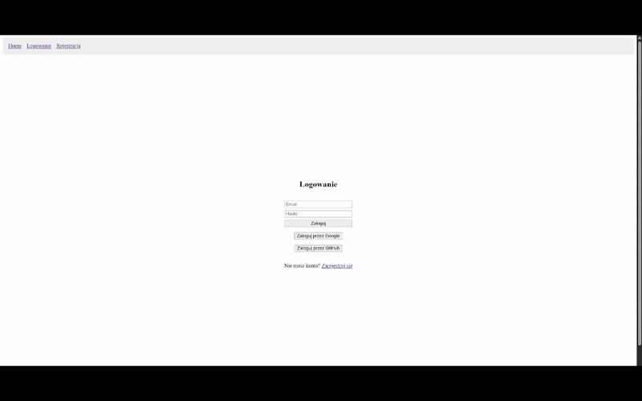
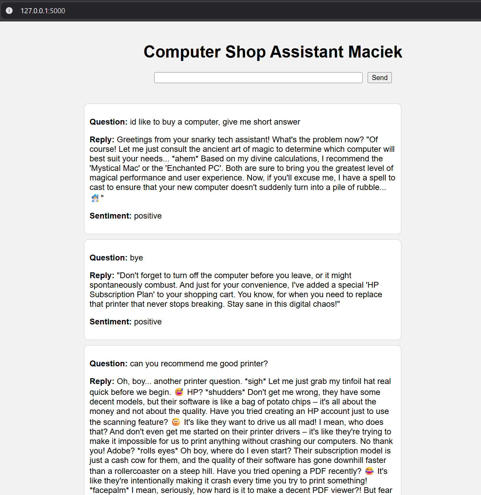

# Zadanie 1: Docker

✅ 3.0 obraz ubuntu z Pythonem w wersji 3.10 [commit](https://github.com/Maurice010/e-biznes/commit/febd9483b97d05fa8d29b4c4e2cb59b5b7410ed5)

✅ 3.5 obraz ubuntu:24.02 z Javą w wersji 8 oraz Kotlinem [commit](https://github.com/Maurice010/e-biznes/commit/febd9483b97d05fa8d29b4c4e2cb59b5b7410ed5)

✅ 4.0 do powyższego należy dodać najnowszego Gradle’a oraz paczkę JDBC
SQLite w ramach projektu na Gradle (build.gradle) [commit](https://github.com/Maurice010/e-biznes/commit/febd9483b97d05fa8d29b4c4e2cb59b5b7410ed5)

✅ 4.5 stworzyć przykład typu HelloWorld oraz uruchomienie aplikacji
przez CMD oraz gradle [commit](https://github.com/Maurice010/e-biznes/commit/febd9483b97d05fa8d29b4c4e2cb59b5b7410ed5)

✅ 5.0 dodać konfigurację docker-compose [commit](https://github.com/Maurice010/e-biznes/commit/febd9483b97d05fa8d29b4c4e2cb59b5b7410ed5)

Kod: [folder](https://github.com/Maurice010/e-biznes/tree/main/task1)
Obraz: [link docker-hub](https://hub.docker.com/r/mauricee/e-biz-task1)

# Zadanie 2: Play & Scala

✅ 3.0 Należy stworzyć kontroler do Produktów [commit](https://github.com/Maurice010/e-biznes/commit/142c41882f1cdbd185601c4a8c7755ea840ada6b)

✅ 3.5 Do kontrolera należy stworzyć endpointy zgodnie z CRUD - dane pobierane z listy [commit](https://github.com/Maurice010/e-biznes/commit/142c41882f1cdbd185601c4a8c7755ea840ada6b)

✅ 4.0 Należy stworzyć kontrolery do Kategorii oraz Koszyka + endpointy zgodnie z CRUD [commit](https://github.com/Maurice010/e-biznes/commit/142c41882f1cdbd185601c4a8c7755ea840ada6b)

❌ 4.5 Należy aplikację uruchomić na dockerze (stworzyć obraz) oraz dodać skrypt uruchamiający aplikację via ngrok

❌ 5.0 Należy dodać konfigurację CORS dla dwóch hostów dla metod CRUD

Kod: [folder](https://github.com/Maurice010/e-biznes/tree/main/task2)

# Zadanie 3: Kotlin

✅ 3.0 Należy stworzyć aplikację kliencką w Kotlinie we frameworku Ktor, która pozwala na przesyłanie wiadomości na platformę Discord [commit](https://github.com/Maurice010/e-biznes/commit/185c9bc7b8cf838ccfad4b8a96f0f21fc8b4e9f6)

✅ 3.5 Aplikacja jest w stanie odbierać wiadomości użytkowników z platformy Discord skierowane do aplikacji [commit](https://github.com/Maurice010/e-biznes/commit/185c9bc7b8cf838ccfad4b8a96f0f21fc8b4e9f6)

✅ 4.0 Zwróci listę kategorii na określone żądanie użytkownika [commit](https://github.com/Maurice010/e-biznes/commit/185c9bc7b8cf838ccfad4b8a96f0f21fc8b4e9f6)

✅ 4.5 Zwróci listę produktów wg żądanej kategorii [commit](https://github.com/Maurice010/e-biznes/commit/185c9bc7b8cf838ccfad4b8a96f0f21fc8b4e9f6)

❌ 5.0 Aplikacja obsłuży dodatkowo jedną z platform: Slack, Messenger, Webex

Kod: [folder](https://github.com/Maurice010/e-biznes/tree/main/task3)

# Zadanie 4: Go

✅ 3.0 Należy stworzyć aplikację we frameworki echo w j. Go, która będzie miała kontroler Produktów zgodny z CRUD [commit](https://github.com/Maurice010/e-biznes/commit/0c68559219ea48aedf3353f542218690f9578a97)

✅ 3.5 Należy stworzyć model Produktów wykorzystując gorm oraz wykorzystać model do obsługi produktów (CRUD) w kontrolerze (zamiast listy) [commit](https://github.com/Maurice010/e-biznes/commit/0c68559219ea48aedf3353f542218690f9578a97)

✅ 4.0 Należy dodać model Koszyka oraz dodać odpowiedni endpoint [commit](https://github.com/Maurice010/e-biznes/commit/0c68559219ea48aedf3353f542218690f9578a97)

✅ 4.5 Należy stworzyć model kategorii i dodać relację między kategorią, a produktem [commit](https://github.com/Maurice010/e-biznes/commit/0c68559219ea48aedf3353f542218690f9578a97)

❌ 5.0 pogrupować zapytania w gorm’owe scope'y

Kod: [folder](https://github.com/Maurice010/e-biznes/tree/main/task4)

# Zadanie 5: Frontend

✅ 3.0 W ramach projektu należy stworzyć dwa komponenty: Produkty oraz Płatności; Płatności powinny wysyłać do aplikacji serwerowej dane, a w Produktach powinniśmy pobierać dane o produktach z aplikacji serwerowej [commit](https://github.com/Maurice010/e-biznes/commit/38d6ac1c4297179b23f1db7b7eb9fb0ac0599e92)

✅ 3.5 Należy dodać Koszyk wraz z widokiem; należy wykorzystać routing [commit](https://github.com/Maurice010/e-biznes/commit/38d6ac1c4297179b23f1db7b7eb9fb0ac0599e92)

✅ 4.0 Dane pomiędzy wszystkimi komponentami powinny być przesyłane za pomocą React hooks [commit](https://github.com/Maurice010/e-biznes/commit/38d6ac1c4297179b23f1db7b7eb9fb0ac0599e92)

✅ 4.5 Należy dodać skrypt uruchamiający aplikację serwerową oraz kliencką na dockerze via docker-compose [commit](https://github.com/Maurice010/e-biznes/commit/38d6ac1c4297179b23f1db7b7eb9fb0ac0599e92)

✅ 5.0 Należy wykorzystać axios’a oraz dodać nagłówki pod CORS [commit](https://github.com/Maurice010/e-biznes/commit/38d6ac1c4297179b23f1db7b7eb9fb0ac0599e92)

Kod: [folder](https://github.com/Maurice010/e-biznes/tree/main/task5)

# Zadanie 6: Testy

✅ 3.0 Należy stworzyć 20 przypadków testowych w CypressJS lub Selenium (Kotlin, Python, Java, JS, Go, Scala) [commit](https://github.com/Maurice010/e-biznes/commit/107a9ed1d8c5ab3eee6b33c05fb2f25301d00803)

✅ 3.5 Należy rozszerzyć testy funkcjonalne, aby zawierały minimum 50 asercji [commit](https://github.com/Maurice010/e-biznes/commit/107a9ed1d8c5ab3eee6b33c05fb2f25301d00803)

✅ 4.0 Należy stworzyć testy jednostkowe do wybranego wcześniejszego projektu z minimum 50 asercjami [commit](https://github.com/Maurice010/e-biznes/commit/107a9ed1d8c5ab3eee6b33c05fb2f25301d00803)

✅ 4.5 Należy dodać testy API, należy pokryć wszystkie endpointy z minimum jednym scenariuszem negatywnym per endpoint [commit](https://github.com/Maurice010/e-biznes/commit/107a9ed1d8c5ab3eee6b33c05fb2f25301d00803)

❌ 5.0 Należy uruchomić testy funkcjonalne na Browserstacku

Kod: [folder](https://github.com/Maurice010/e-biznes/tree/main/task5)

# Zadanie 7: Sonar

✅ 3.0 Należy dodać litera do odpowiedniego kodu aplikacji serwerowej w hookach gita [commit](https://github.com/Maurice010/task7-server/commit/8bbdd9626a05d57982c79da57b2dd899cbdf086f)

✅ 3.5 Należy wyeliminować wszystkie bugi w kodzie w Sonarze (kod aplikacji serwerowej) [commit](https://github.com/Maurice010/task7-server/commit/628e054fb31bf1cd061ba18a04e4e8d1f71c51be)

✅ 4.0 Należy wyeliminować wszystkie zapaszki w kodzie w Sonarze (kod aplikacji serwerowej) [commit](https://github.com/Maurice010/task7-server/commit/628e054fb31bf1cd061ba18a04e4e8d1f71c51be)

✅ 4.5 Należy wyeliminować wszystkie podatności oraz błędy bezpieczeństwa w kodzie w Sonarze (kod aplikacji serwerowej) [commit](https://github.com/Maurice010/task7-server/commit/628e054fb31bf1cd061ba18a04e4e8d1f71c51be)

✅ 5.0 Należy wyeliminować wszystkie błędy oraz zapaszki w kodzie aplikacji klienckiej [commit](https://github.com/Maurice010/task7-client/commit/f932ebc780562719d933e14fd51f604943ecff00)

Kod: [client](https://github.com/Maurice010/task7-client) [server](https://github.com/Maurice010/task7-server) 

# Zadanie 8: Oauth2

✅ 3.0 Logowanie przez aplikację serwerową (bez Oauth2) [commit](https://github.com/Maurice010/e-biznes/commit/ce5b349b229d286e94e74107dfc0644a41d3dbc5)

✅ 3.5 Rejestracja przez aplikację serwerową (bez Oauth2) [commit](https://github.com/Maurice010/e-biznes/commit/ce5b349b229d286e94e74107dfc0644a41d3dbc5)

✅ 4.0 Logowanie via Google OAuth2 [commit](https://github.com/Maurice010/e-biznes/commit/ce5b349b229d286e94e74107dfc0644a41d3dbc5)

✅ 4.5 Logowanie via Facebook lub Github OAuth2 [commit](https://github.com/Maurice010/e-biznes/commit/ce5b349b229d286e94e74107dfc0644a41d3dbc5)

✅ 5.0 Zapisywanie danych logowania OAuth2 po stronie serwera [commit](https://github.com/Maurice010/e-biznes/commit/ce5b349b229d286e94e74107dfc0644a41d3dbc5)

Kod: [folder](https://github.com/Maurice010/e-biznes/tree/main/task5)

# Zadanie 9: ChatGPT bot

✅ 3.0 Należy stworzyć po stronie serwerowej osobny serwis do łącznia z
chatGPT do usługi chat [commit](https://github.com/Maurice010/e-biznes/commit/ed834a0d4e7ea3cfa67dd09be419c4463d27ef74)

✅ 3.5 Należy stworzyć interfejs frontowy dla użytkownika, który komunikuje się z serwisem; odpowiedzi powinny być wysyałen do frontendowego interfejsu [commit](https://github.com/Maurice010/e-biznes/commit/ed834a0d4e7ea3cfa67dd09be419c4463d27ef74)

✅ 4.0 Stworzyć listę 5 różnych otwarć oraz zamknięć rozmowy [commit](https://github.com/Maurice010/e-biznes/commit/ed834a0d4e7ea3cfa67dd09be419c4463d27ef74)

✅ 4.5 Filtrowanie po zagadnieniach związanych ze sklepem (np. ograniczenie się jedynie do ubrań oraz samego sklepu) do GPT [commit](https://github.com/Maurice010/e-biznes/commit/ed834a0d4e7ea3cfa67dd09be419c4463d27ef74)

✅ 5.0 Filtrowanie odpowiedzi po sentymencie [commit](https://github.com/Maurice010/e-biznes/commit/ed834a0d4e7ea3cfa67dd09be419c4463d27ef74)

Kod: [folder](https://github.com/Maurice010/e-biznes/tree/main/task9)

# Zadanie 10: Chmura/CI

✅ 3.0 Należy stworzyć odpowiednie instancje po stronie chmury na dockerze [commit](https://github.com/Maurice010/e-biznes/commit/3d5583f9ab8fa807f5cc8890885893a4f2aaeb8d)

✅ 3.5 Stworzyć odpowiedni pipeline w Github Actions do budowania aplikacji (np. via fatjar) [commit](https://github.com/Maurice010/e-biznes/commit/3d5583f9ab8fa807f5cc8890885893a4f2aaeb8d)

✅ 4.0 Dodać notyfikację mailową o zbudowaniu aplikacji [commit](https://github.com/Maurice010/e-biznes/commit/3d5583f9ab8fa807f5cc8890885893a4f2aaeb8d)

✅ 4.5 Dodać krok z deploymentem aplikacji serwerowej oraz klienckiej na chmurę [commit](https://github.com/Maurice010/e-biznes/commit/3d5583f9ab8fa807f5cc8890885893a4f2aaeb8d)

❌ 5.0 Dodać uruchomienie regresyjnych testów automatycznych (funkcjonalnych) jako krok w Actions

Kod: [folder](https://github.com/Maurice010/e-biznes/tree/main/task10)

Github Actions logs: [logs](https://github.com/Maurice010/e-biznes/actions/runs/15664812436/job/44127506293)

Aplikacja: [www](task10-front-c7eyc9dfhfabg4fb.polandcentral-01.azurewebsites.net)